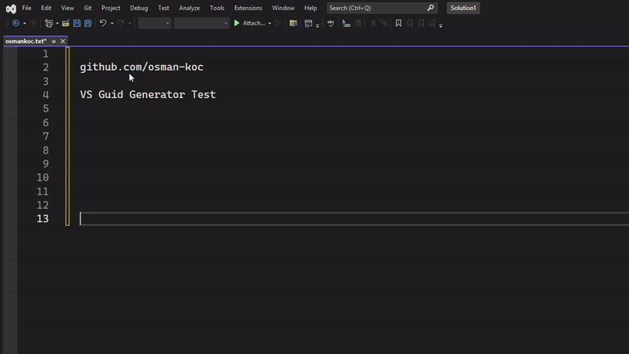
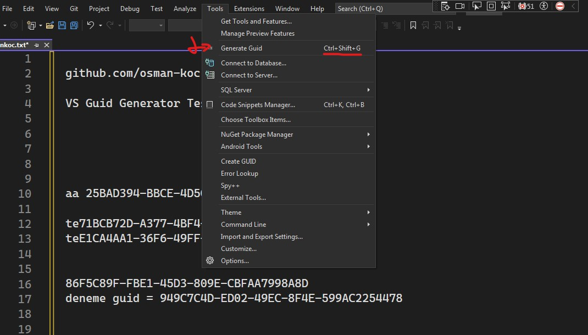

# GuidGenerator - Visual Studio Extension

Generate and insert GUIDs (uuid) effortlessly into your code using a simple shortcut.

## Features

- Quickly generate and insert GUIDs into your code.
- Streamline your workflow with a convenient keyboard shortcut.
- You can use it in multiple lines.

## Requirements

- [Visual Studio](https://visualstudio.microsoft.com)

## Installation

1. Launch Visual Studio.
2. Go to Extensions > Manage Extensions.
3. Search for "GuidGenerator" and click Install.
- [Visual Studio Marketplace](https://marketplace.visualstudio.com/items?itemName=kocdev.guidgeneratorvs)

## Settings

1. Go to Tools > Options.
2. Navigate to Environment > Keyboard.
3. Find `Tools.GenerateGuid` and set a custom shortcut.

## Usage

1. Open a file in which you want to insert a GUID.
2. Place your cursor at the desired insertion point.
3. Press your assigned shortcut to generate and insert a new GUID.

## Visual Studio Extension

Those who use Visual Studio can see the counterpart extension made for Visual Studio here.
- [VS Guid Generator Extension](https://github.com/osman-koc/vs-guid-generator/)

## Contributing

Contributions are welcome! Please fork this repository and submit pull requests.

## License

This project is licensed under the [MIT License](LICENSE).

---

**Enjoy!**
